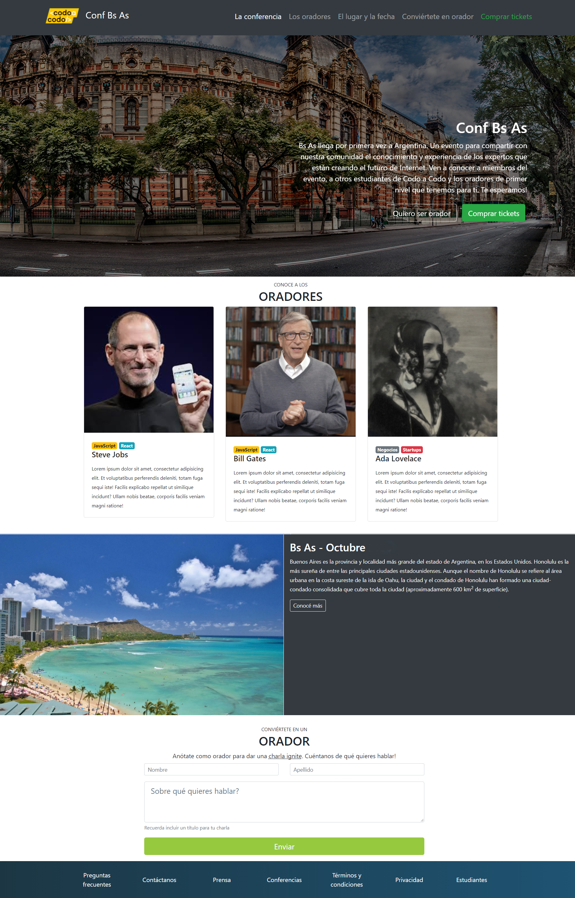

# TP Integrador Frontend

## Comision 23558 - Alumno: Elias Orihuela

## Sitio Web
<a href="teotronic5438.github.io">teotronic5438.github.io</a>

Objetivo: replicar la siguiente página principal con lo visto en clase hasta el momento

Se recomienda usar bootstrap, en nuestro caso usaremos <a href="https://getbootstrap.com/docs/5.3/getting-started/introduction/">Bootstrap v5.3.2</a>

